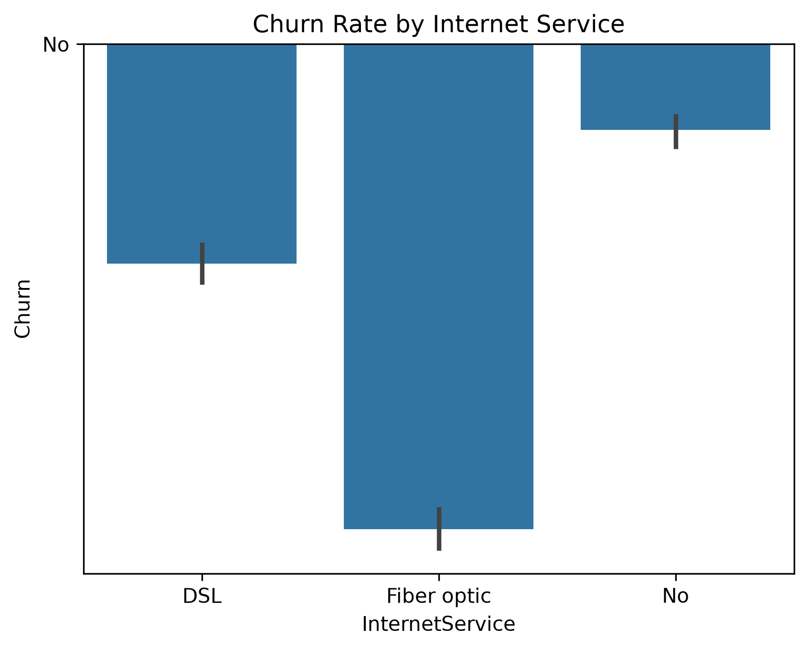
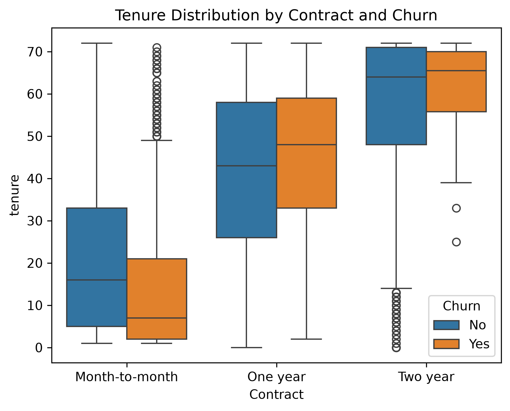

# ChurnSense

I built ChurnSense to predict which telecom customers are likely to cancel their service. I cleaned the Telco Customer Churn dataset, explored it with a couple of charts, and trained an XGBoost classifier tuned to catch as many churners as possible despite the imbalance between customers who stay and customers who leave.

## Dataset

I used the [Telco Customer Churn dataset](https://www.kaggle.com/datasets/blastchar/telco-customer-churn) from Kaggle. It contains 7,043 customers with account details, subscribed services, billing information, and a `Churn` label showing whether the customer left. I saved the original file in this repo as `dataset.csv`.

## Project Structure

```
ChurnSense/
├── Graphs/
│   ├── churn_by_internet_service.png
│   └── tenure_by_contract.png
├── DataClean.py
├── train.py
├── dataset.csv
├── cleaned_churn.csv
└── README.md
```

- `DataClean.py` cleans the raw data and creates the exploratory graphs.
- `train.py` trains, tunes, and evaluates the model.
- `dataset.csv` is the raw data and `cleaned_churn.csv` is my cleaned output.

## Exploratory Analysis

I generated graphs to understand what drives churn before modeling.

**Churn rate by internet service type**



**Tenure distribution by contract type, split by churn**



## Data Cleaning

In `DataClean.py` I:

- Dropped `customerID`, since it carries no predictive information.
- Encoded `gender` as 1 for Male and 0 for Female.
- Replaced "No phone service" in `MultipleLines` with "No".
- Replaced "No internet service" with "No" in `OnlineSecurity`, `OnlineBackup`, `DeviceProtection`, `TechSupport`, `StreamingTV`, and `StreamingMovies`.
- Converted all Yes/No columns, including the `Churn` target, to 1/0.
- Converted `TotalCharges` to a numeric column and filled the missing values with 0.
- Saved the result as `cleaned_churn.csv`.

## Modeling

In `train.py` I:

1. Split the data 80/20 into training and test sets, stratified on `Churn` so both sets keep the same class balance.
2. One-hot encoded `InternetService`, `Contract`, and `PaymentMethod`.
3. Calculated the class imbalance ratio from the training set and used it as a candidate for XGBoost's `scale_pos_weight`.
4. Ran a grid search with 5-fold stratified cross-validation, scored on average precision, over `n_estimators`, `learning_rate`, `max_depth`, `min_child_weight`, and `scale_pos_weight`.
5. Tested decision thresholds from 0.10 to 0.85 and kept the one that gave the best F1 score, instead of using the default 0.5.

I also imported Logistic Regression and Decision Tree classifiers as baseline options, but the final model is the tuned XGBoost classifier.

## Results

Evaluated on a held-out test set of 1,409 customers (20% stratified split).

| Model               | ROC-AUC |
|---------------------|---------|
| Logistic Regression | 0.7983 (79.8%) |
| XGBoost (tuned)     | 0.8436 (84.3%)   |

XGBoost was tuned with 5-fold stratified cross-validation using
average precision as the scoring metric.

## How to Run

1. Clone the repository:
   ```bash
   git clone https://github.com/muhamedale39-creator/ChurnSense.git
   cd ChurnSense
   ```
2. Install the dependencies:
   ```bash
   pip install numpy pandas matplotlib seaborn scikit-learn xgboost
   ```
3. Clean the data and generate the graphs:
   ```bash
   python DataClean.py
   ```
4. Train and evaluate the model:
   ```bash
   python train.py
   ```

## Tech Stack

Python, pandas, NumPy, scikit-learn, XGBoost, Matplotlib, Seaborn
